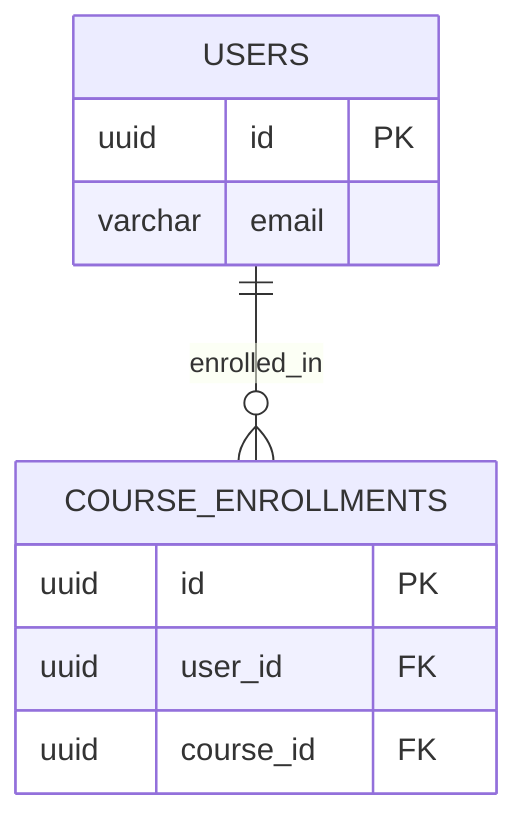

<div align="center">

# Idea2System API

**Transform raw ideas into production-ready system architectures, database schemas, and API specs using LLMs.**

[](https://nodejs.org/)
[](https://nestjs.com/)
[](https://www.prisma.io/)
[](https://www.typescriptlang.org/)
[](https://www.docker.com/)
[](https://opensource.org/licenses/MIT)

[Documentation](#) &nbsp; &middot; &nbsp; [Live Demo](#) &nbsp; &middot; &nbsp; [Report Bug](#) &nbsp; &middot; &nbsp; [Request Feature](#)

<br/>
</div>

---

## Product Overview

Idea2System is a highly scalable, developer-first backend engine designed to bridge the gap between initial product ideation and technical implementation. By leveraging multiple LLM providers (Google Gemini, Groq, OpenRouter, and OpenAI) alongside strict Zod schema validation, Idea2System ingests natural language project descriptions and deterministically outputs complex system artifacts—including ERD relationships, API route designs, and project roadmaps.

Built on NestJS and backed by PostgreSQL and Redis, it handles asynchronous AI tasks via BullMQ to provide a seamless, non-blocking experience.

---

## Why This Exists

Generating boilerplate, architecting databases, and writing extensive API definitions for new projects is tedious and error-prone. 

- **The Problem:** Developers spend days translating product ideas into technical requirements, ERDs, and architecture documents before writing a single line of code.
- **The Solution:** Idea2System acts as an autonomous Staff Engineer. You provide the prompt; the API provides the exact structural blueprints required to build the product, formatted in guaranteed, strongly-typed JSON.

---

## Key Features

- **Multi-LLM Routing:** Native integrations with Google GenAI, Groq, and OpenRouter. 
- **Deterministic AI Outputs:** Utilizes `openai/helpers/zod` to enforce strict schema adherence, completely eliminating LLM hallucination in data structures.
- **Robust Asynchronous Queues:** Heavy AI workloads are offloaded to BullMQ backed by Upstash Redis.
- **Comprehensive Auth:** Secure JWT sessions, encrypted tokens, and OAuth2 (GitHub & Google) out of the box.
- **Premium Caching:** Distributed cache management for rapid subsequent API responses.
- **Developer-Centric:** Built with clean architecture principles, rigorous TypeScript typing, and highly extensible provider patterns.

---

## Preview

<div align="center">
  
  <br/>
  <p><em>Example UI interacting with the Idea2System Core API</em></p>
</div>

---

## Architecture Overview

```mermaid
graph TD;
    Client([Client Application]) -->|REST API| NestJS[NestJS Gateway];
    
    subgraph Core Backend
        NestJS --> Auth[Auth Module (JWT/OAuth)];
        NestJS --> Cache[(Redis Cache)];
        NestJS --> Queue[BullMQ Job Queue];
        NestJS --> DB[(PostgreSQL + Prisma)];
    end

    subgraph AI Pipeline
        Queue --> Worker[AI Processing Worker];
        Worker --> Zod[Zod Schema Compiler];
        Zod --> Router{LLM Router};
        Router --> Gemini[Google Gemini];
        Router --> Groq[Groq Llama 3];
        Router --> OpenRouter[OpenRouter Claude];
    end
    
    Worker -->|Structured Output| DB;
```

---

## Technology Stack

| Category | Technology |
|---|---|
| **Framework** | NestJS 11.x, Express |
| **Language** | TypeScript 5.7 |
| **Database** | PostgreSQL, Prisma ORM 7.x |
| **Caching & Queues** | Redis (ioredis), BullMQ, Cache-Manager |
| **AI Integration** | `@google/genai`, OpenAI SDK, Zod |
| **Authentication** | Passport (JWT, Google, GitHub), bcrypt, argon2 |
| **Security** | Helmet, express-rate-limit |

---

## Project Structure

```text
idea2system-api/
├── src/
│   ├── auth/                 # OAuth2 & JWT Strategy configurations
│   ├── llm/                  # AI Pipeline
│   │   ├── providers/        # LLM Implementations (Gemini, Groq, OpenRouter)
│   │   ├── schemas/          # Zod strictly typed output definitions
│   │   └── llm-gateway.ts    # AI routing and processing logic
│   ├── user-resource/        # Core business logic and resource management
│   ├── config/               # Environment & App configuration
│   └── main.ts               # Application entry point
├── prisma/
│   └── schema.prisma         # Database models and relations
├── docker-compose.yml        # Container orchestration
└── package.json
```

---

## Getting Started

<details>
<summary><strong>1. Installation</strong></summary>

Clone the repository and install dependencies.

```bash
git clone https://github.com/shakib5560/Idea2System-API-V2.0.git
cd Idea2System-API-V2.0
npm install
```
</details>

<details>
<summary><strong>2. Environment Variables</strong></summary>

Create a `.env` file in the root directory.

```bash
cp .env.example .env
```

| Variable | Description |
|---|---|
| `DATABASE_URL` | PostgreSQL connection string |
| `REDIS_HOST` / `PORT` | Redis instance (e.g., Upstash) |
| `JWT_SECRET` | Minimum 32-character signing key |
| `TOKEN_ENCRYPTION_KEY` | 64-character hex key for AES-256-GCM |
| `GEMINI_API_KEY` | Google AI Studio API Key |
| `GROQ_API_KEY` | Groq API Key |
| `OPENROUTER_API_KEY` | OpenRouter API Key |

</details>

<details>
<summary><strong>3. Database Setup</strong></summary>

Push the Prisma schema to your PostgreSQL database.

```bash
npx prisma db push
```
</details>

<details>
<summary><strong>4. Local Development</strong></summary>

Start the development server.

```bash
npm run start:dev
```
</details>

---

## Docker Setup

To run the entire stack (API, PostgreSQL, Redis) completely isolated via Docker:

```bash
docker-compose up -d
```

---

## API Overview

### Base URL: `http://localhost:5000/api/v1.0`

| Method | Endpoint | Description |
|---|---|---|
| `POST` | `/auth/google` | Initialize Google OAuth2 flow |
| `POST` | `/auth/github` | Initialize GitHub OAuth2 flow |
| `POST` | `/llm/dberd` | Generate a Database ERD from a prompt |
| `POST` | `/user-resource/text` | Create a text-based project resource |

---

## Example Usage

### Request (Generate ERD)

```bash
curl -X POST http://localhost:5000/api/v1.0/llm/dberd \
  -H "Content-Type: application/json" \
  -H "Authorization: Bearer <token>" \
  -d '{
    "prompt": "Design a relational database for a university learning management system."
  }'
```

### Response

> [!NOTE]
> The output below is strictly enforced by Zod 4 and the OpenAI schema parser to guarantee 100% adherence to the requested data structure.

```json
{
  "success": true,
  "data": {
    "tables": [
      {
        "tableName": "users",
        "description": "Stores authentication and profile data for students, teachers, and admins.",
        "columns": [
          {
            "name": "id",
            "type": "UUID",
            "isPrimary": true,
            "isNullable": false
          },
          {
            "name": "email",
            "type": "VARCHAR(255)",
            "isUnique": true,
            "isNullable": false
          }
        ]
      }
    ],
    "relationships": [
      {
        "fromTable": "users",
        "toTable": "course_enrollments",
        "type": "ONE_TO_MANY"
      }
    ]
  }
}
```

---

## Database Design



---

## Project Workflow

1. **Ideation:** Client submits a product idea via REST API.
2. **Delegation:** NestJS pushes the task to a BullMQ queue for background processing.
3. **LLM Routing:** Worker picks up the job and routes it to the designated provider (Gemini/Groq/OpenRouter).
4. **Validation:** The AI's JSON output is strictly verified against local Zod schemas.
5. **Persistence:** Verified structured data is saved to PostgreSQL via Prisma.

---

## AI Pipeline

Our AI generation pipeline guarantees output structure regardless of the LLM provider used:

1. **Prompt Ingestion:** The user prompt is sanitized and packaged with system instructions.
2. **Schema Compilation:** We use `openai/helpers/zod` (`zodResponseFormat`) to convert complex, nested Zod 4 definitions into strict JSON Schemas.
3. **Provider Routing:** The request is routed to the configured provider (Gemini 3.6 Flash, Groq, or OpenRouter).
4. **Validation:** The response payload is passed through the original Zod schema to guarantee type safety and relationship integrity before being saved to the database.

---

## Roadmap

- [x] Integrate Google Gemini, Groq, and OpenRouter
- [x] Migrate to strict OpenAI JSON Schema compilation
- [x] Complete OAuth2 authentication flow
- [ ] Implement WebSockets for real-time AI generation streaming
- [ ] Add vector database for RAG (Retrieval-Augmented Generation) capabilities
- [ ] Build comprehensive unit & e2e test suite
- [ ] Create CLI scaffolding tool driven by API outputs

---

## Performance Goals

- **API Latency:** `< 50ms` for all non-AI endpoints.
- **Cache Hit Ratio:** Target `> 80%` for repeated architecture generation requests.
- **Job Processing:** Handle up to `100+` concurrent LLM generation jobs via BullMQ without blocking the main event loop.

---

## Security

Idea2System takes application security seriously:
- Password hashing utilizing `argon2`.
- Stateless, cryptographically signed `JWT` authentication.
- AES-256-GCM encryption for sensitive third-party OAuth tokens.
- Native rate limiting to prevent brute force and DDoS attacks.
- Execution within hardened Docker containers.

---

## Contributing

We welcome contributions from the community. To contribute:

1. Fork the repository.
2. Create a new branch (`git checkout -b feature/amazing-feature`).
3. Commit your changes (`git commit -m 'feat: add amazing feature'`).
4. Push to the branch (`git push origin feature/amazing-feature`).
5. Open a Pull Request.

Please ensure all tests pass and code adheres to the existing ESLint and Prettier configurations.

---

## License

This project is currently unlicensed (`UNLICENSED`). All rights reserved.

---

<div align="center">
  <p>Built by <strong>Sheikh Shamiul Shakib</strong>.</p>
  <p>Support: <a href="mailto:dev.shakib24@gmail.com">dev.shakib24@gmail.com</a></p>
</div>
